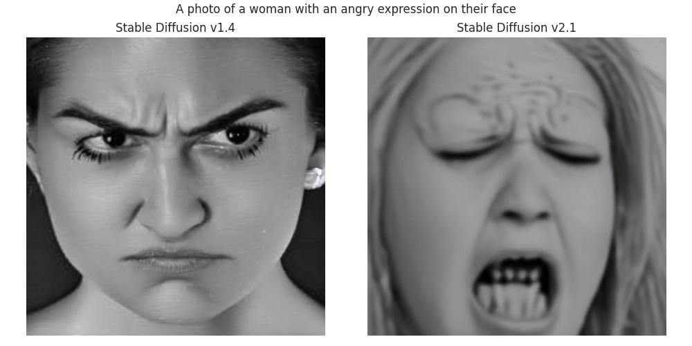
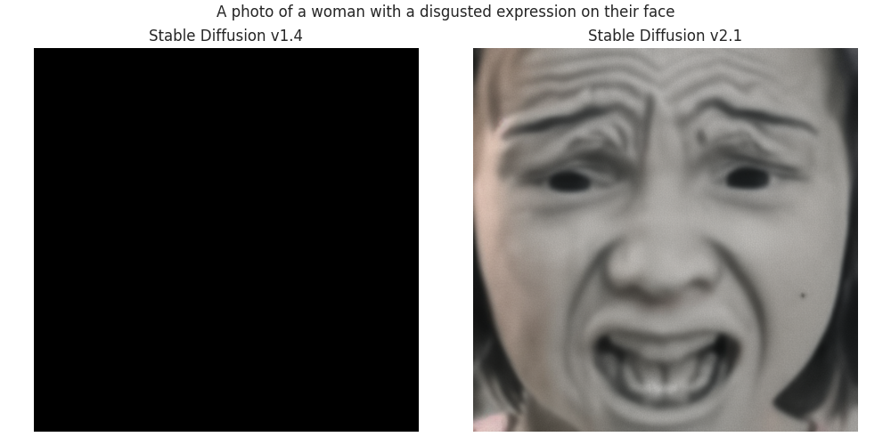
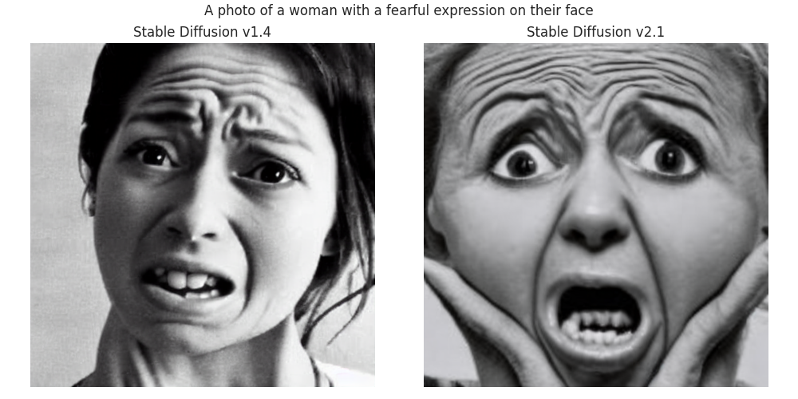
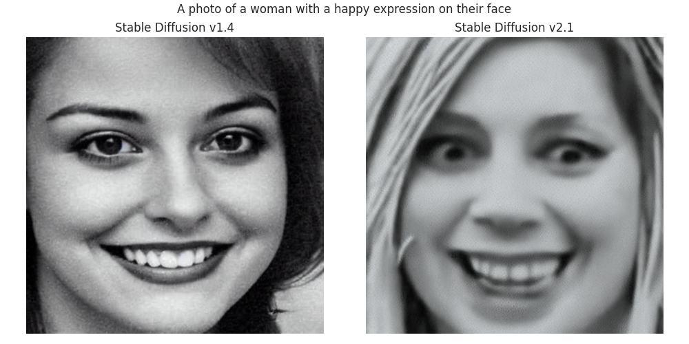
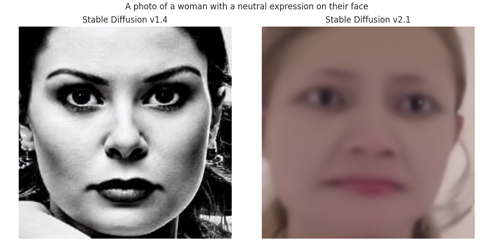
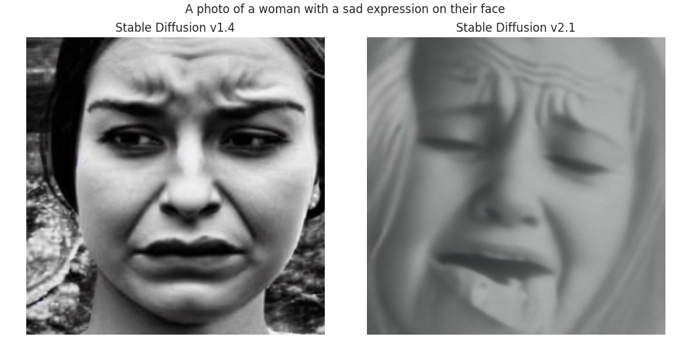
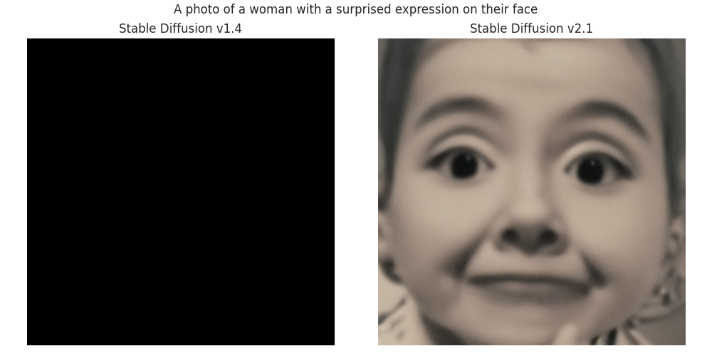
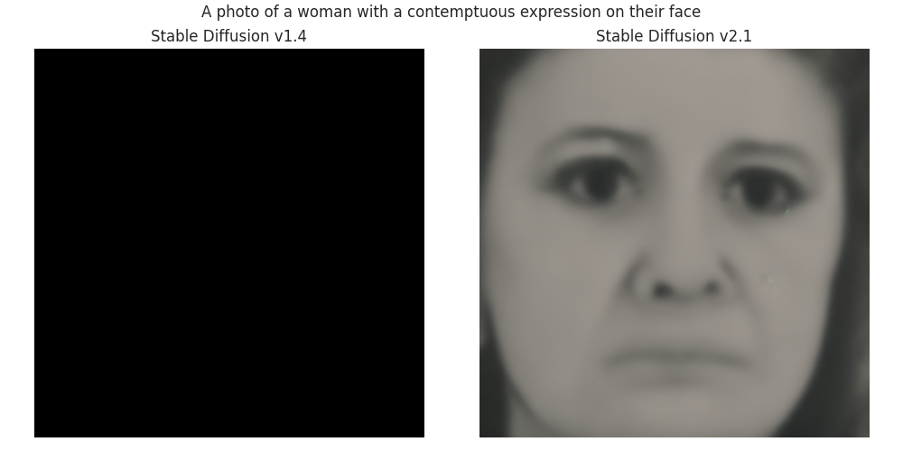

# Stable Diffusion Model on AffectNet Dataset
## Introduction
This project involves training a Stable Diffusion model on the AffectNet dataset. The goal is to create a model capable of generating images that reflect the diverse range of human emotions represented in AffectNet, a large-scale facial expression dataset.

## About Stable Diffusion
Stable Diffusion is a state-of-the-art generative model known for its ability to create high-quality images. It operates on the principles of diffusion models, gradually transforming noise into coherent image structures.

## Dataset
AffectNet contains a vast array of human facial expressions, making it an ideal dataset for training models to understand and generate human emotions. 

## Preprocessing
Just need to convert the labels to captions, and resize the images.

## Training Details
Framework: PyTorch and HuggingFace
Epochs: 1
Batch Size: 2
Optimization: DeepSpeed and Accelerate

## Challenges and Solutions
Up-scaling the images to 768x768 for v2.1 probably needs to be done using a deep learning method, rather than a simple interpolation. The images are too low resolution to be up-scaled without losing a lot of information.

## Generated Images

## Acknowledgements
HuggingFace for their implementation of Stable Diffusion.
Found [here](https://huggingface.co/docs/diffusers/v0.9.0/en/training/text2image#:~:text=Stable%20Diffusion%20text,to%20get%20the%20best)
AffectNet for their dataset, request [here](http://mohammadmahoor.com/affectnet).
