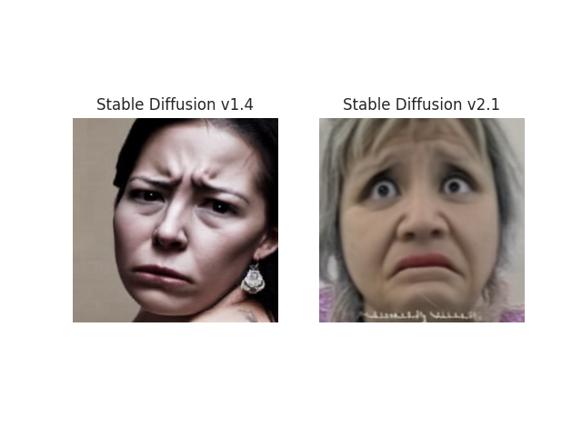
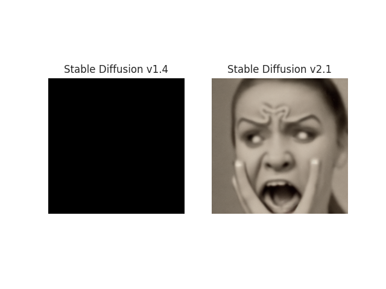
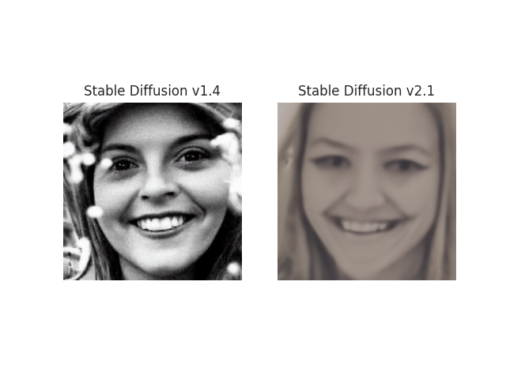
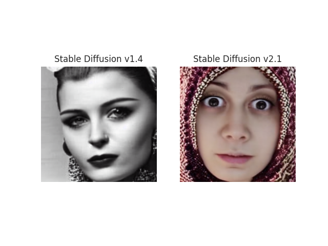
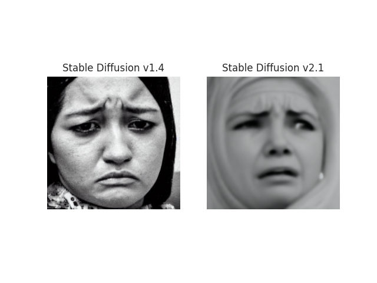
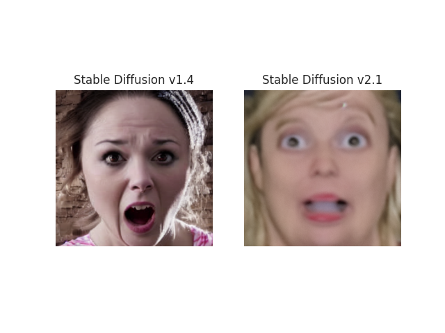
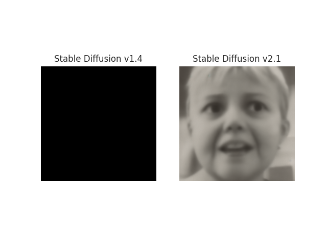

# Stable Diffusion Model on AffectNet Dataset
## Introduction
This project involves training a Stable Diffusion model on the AffectNet dataset. The goal is to create a model capable of generating images that reflect the diverse range of human emotions represented in AffectNet, a large-scale facial expression dataset.

## About Stable Diffusion
Stable Diffusion is a state-of-the-art generative model known for its ability to create high-quality images. It operates on the principles of diffusion models, gradually transforming noise into coherent image structures.

## Dataset
AffectNet contains a vast array of human facial expressions, making it an ideal dataset for training models to understand and generate human emotions. 

## Preprocessing

## Training Details
Framework: PyTorch and HuggingFace
Epochs: 1
Batch Size: 2
Optimization: DeepSpeed and Accelerate

## Challenges and Solutions

## Results

## Usage

## Generating Images

## Acknowledgements

